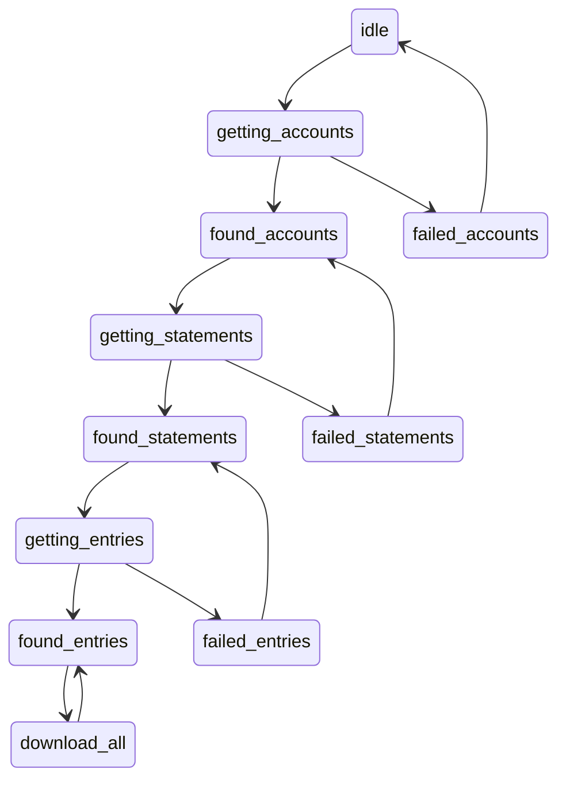

# OBIS architecture notes

Folders:

- `_mock-server/` - For running a "fake" HSBC site for testing
- `common/` - General client/server helpers
- `plugins/<bank-name>/plugin.json`
- `ui/` - OBIS main UI + statements-browser

The OBIS UI is built with [Mithril.js](https://mithril.js.org/) and [Statebot](https://github.com/shuckster/statebot), hence the state-charts:

## Application state-chart



The HSBC UK parser uses [JMESPath](https://jmespath.org/), which takes a great
deal of tedium out of parsing JSON API responses.

## Build system overview

Build commands:

```sh
pnpm run build:all    # create dist/
pnpm run debug        # watch build + run mock-data server
pnpm run debug:live   # run server for testing against a live site
```

Flow:

```
.----------.
| build.js |
'-+--------'
  |
  |   .---------.                            .----------------.
  +---> esbuild +--------------------------+-> bookmarklet.js +--------+
  |   '---------'                          | '----------------'        |
  |                                        |                           |
  |   .----------------------------.       | .---------.               |
  +---> src/plugins/**/plugin.json |       +-> main.js +---------------+
      '---+------------------------'         '---------'               |
          |                                                            |
          |   .------------------------.     .-------------------.     |
          +---> { name } = plugin.json +-----> ${name}/plugin.js |     |
          |   '------------------------'     '----+--------------'     |
          |                                       |                    |
          |                                  .----v----.               |
          |   .-----------------.            | esbuild +-----+         |
          +---> Create registry |            '---------'     |         |
              | > plugins.js    |                            |         |
              '--------+--------'                            |         |
                       |                                     |         |
                       |                               .-----v-----.   |
                       |                               |           |   |
                       +------------------------------->   dist/   <---+
                                                       |           |
                                                       '-----------'
```

## Module aliases

### `@/ = src/common`

| Configured:   | Used by:                                                      |
| ------------- | ------------------------------------------------------------- |
| package.json  | `module-alias/register` used by `build.js` and `_mock-server` |
| jsconfig.json | esbuild                                                       |
