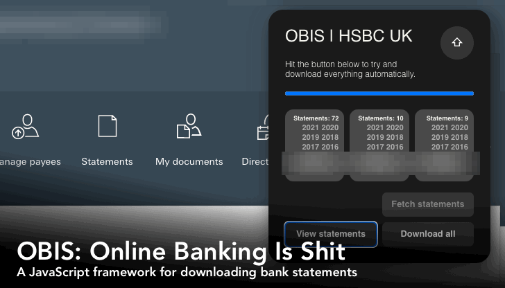

# OBIS: Online Banking Is Shit

## A JavaScript framework for downloading bank statements

- [Recent updates](./CHANGELOG.md)

OBIS can download statements from HSBC UK Personal Banking in a variety
of formats. HSBC has historically been very limiting with its download
options, and since 2021 only allows PDF downloads of your statements.

That's shit. OBIS can generate a Zip of your statements in OFX, QIF,
CSV, and JSON:



OBIS currently supports _only_ HSBC UK, but other parsers are possible.

## How to use it

### ...as a Web Extension

The easiest way to use OBIS is to install it as an Extension into Google
Chrome. You can either build it yourself or download it from the Chrome
Web Store (coming soon, pending approval!)

To build it yourself:

- Download the project from Github
- Navigate to: `chrome://extensions/`
- Enable `Developer mode [ o ]`
- Click the `[ Load unpacked ]` button
- Choose the downloaded `dist/extension/` folder

You'll see the OBIS interface after logging-in to your HSBC account.

### ...as a bookmarklet

I use this mode when developing OBIS, but it also used to be the _only_
way to run it:

- Open `dist/bookmarklet.js`
- Copy everything
- Paste into a new bookmark
- Log into your HSBC UK account
- Click the bookmark

Due to recent security improvements to browsers it's unlikely you'll be
able to do this directly from the Github master.

You'll need to build the project locally:

```sh
git clone https://github.com/shuckster/OBIS.git
cd OBIS
pnpm i
pnpm run debug:live
```

At this point a server should be running and a bookmarklet that points
to it will have been built in `dist/`. Create a bookmark based on _this_
bookmarklet and click it after logging into your HSBC UK account.

As the procedure hosts OBIS via `localhost` it should bypass the CORB
security checks.

## Is it safe?

If you're concerned about security on the Internet (and you should be)
feel free to browse the code of the project right here on Github. For
maximum peace of mind you can fork the project to inspect and build it
yourself.

If approved by Google, you can use OBIS via the official Chrome
Extension. Hopefully this will instill a little more trust as they
curate the content of their Web Store.

## About

OBIS was written by [Conan Theobald](https://github.com/shuckster/).

## Contributing

To support my efforts with this project please consider checking out the
accountancy company I work for: [Crunch](https://www.crunch.co.uk/).

If you'd rather not change your accountancy solution but OBIS has
made managing your finances a little less shit, you can
[buy me a coffee](https://www.buymeacoffee.com/shuckster). :)

## Credits

Many thanks to these contributors:

- @lesterw1
- @masterell
- @prisonblues

🙏

Inspired by:

- https://github.com/LTheobald/HSBCToOFX (Removed, but [author](https://github.com/LTheobald) still active.)
- https://ar.al/3744/

## License

MIT licensed: See [LICENSE](LICENSE)
